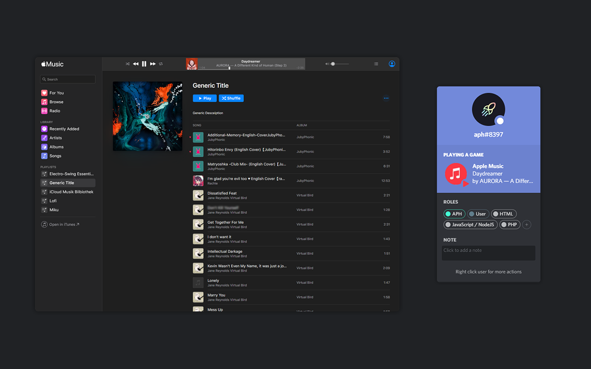

      
  <h1 align="center">
    Apple Music RP
  </h1>

<h3 align="center">
Show of the Music you're listening to on Discord using this Light-weight Application
</h3>

<h3 align="center">
        
      
      
      
</h3>

# Installation
Download the Browser Extension from the <a href="https://addons.mozilla.org/de/firefox/addon/apple-music/">Firefox</a> / <a href="#">Google Chrome</a> Store and the Server Application from the Releases Tab. Once both are installed, execute the Server Application. 
You're done. Discord will automaticly detect that you have the Server running and will Display it in your Profile.

# Todo
- [X] Switch modules from `discord-rich-presence` to `discord-rpc`
- [X] Update Icons
- [ ] Google Chrome Version
